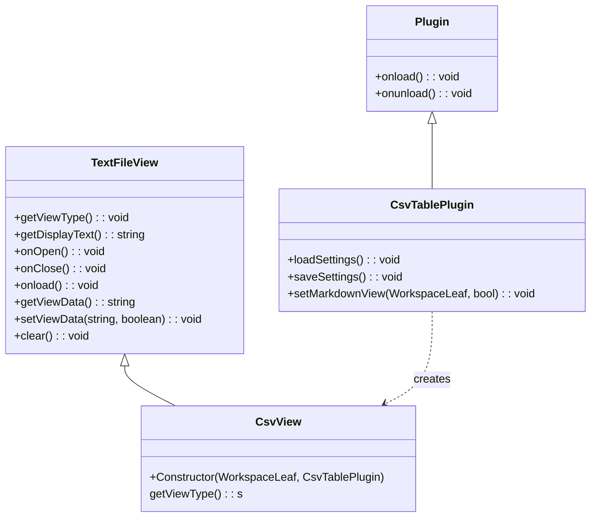

# Architektur

## Data Actions
- EVENT_CELL_MOVE
- UPDATE_DATA_CELL
- DELETE_DATA_CELL
- MOVE_DATA_COL
- INSERT_DATA_COLUMN
- DELETE_DATA_COLUMN
- MOVE_DATA_ROW
- INSERT_DATA_COLUMN
- DELETE_DATA_COLUMN

## Classes

